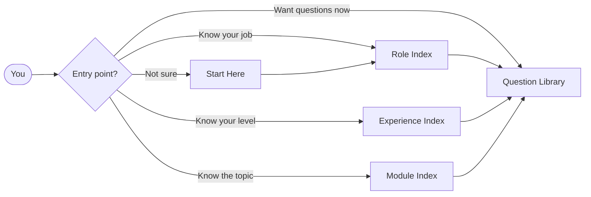
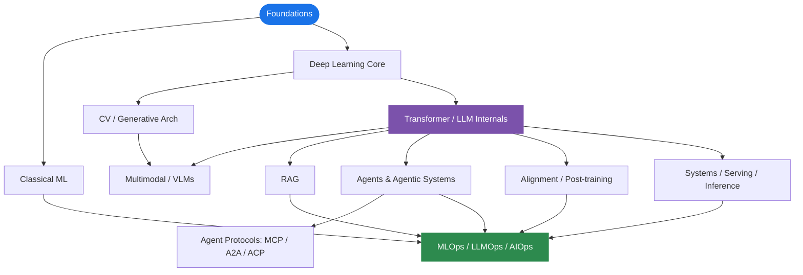

# SCAI AI Interview OS

**A Role-Aware, Experience-Calibrated AI Interview Preparation System**

Built by [School of Core AI](https://schoolofcoreai.com). Structured for engineers who build, deploy, debug, and scale AI systems — not for people looking for definitions to memorize.

**155+ schema-strict interview questions** across 7 modules, covering foundations through production operations. Navigable by role, experience band, topic, and interview round.

---

## What Is This?

AI Interview OS is a structured interview operating system covering the full modern AI engineering stack. It is navigable by role, by experience band, by topic family, by interview mode, and by tag.

Every question follows a strict schema with metadata, difficulty ratings, experience bands, role relevance, follow-ups, weak answer patterns, and production insights.

**This is not a notes library. This is not a syllabus dump. This is an interview system.**

It answers:
- What should I study first based on my background?
- What do companies expect at my experience level?
- Which topics are foundational vs advanced vs architect-level?
- Which parts are research-heavy vs deployment-heavy?
- What should a 2-year engineer know vs a 10-year architect?

---

## Start Here

| Your background | Start with |
|---|---|
| Python / backend engineer moving into AI | [Software Foundations → AI Engineer](docs/personas/software-foundations-to-ai-engineer.md) |
| ML or data engineer | [Data / ML Engineer](docs/personas/ml-data-engineer.md) |
| CV / deep learning engineer | [Deep Learning / CV Engineer](docs/personas/deep-learning-cv-engineer.md) |
| Building copilots, RAG, or agents | [LLM / RAG / Agent Engineer](docs/personas/llm-rag-agent-engineer.md) |
| ML platform or LLM infra | [MLOps / LLMOps / Platform AI](docs/personas/mlops-llmops-platform-engineer.md) |
| DevOps / SRE moving into AIOps | [DevOps / SRE → AIOps](docs/personas/devops-sre-to-aiops.md) |
| Research or applied research | [Research / Applied Research](docs/personas/research-applied-research.md) |
| Senior / staff / architect | [Senior / Architect / AI Systems Lead](docs/personas/senior-architect-ai-systems-lead.md) |

Don't know where to start? → **[Start Here](docs/start-here.md)** for a guided walkthrough.

---

## Navigation



| Entry Point | Best For | Link |
|---|---|---|
| **By Role** | Know your job family | [Role Index](docs/indexes/role-index.md) |
| **By Experience** | Know your career band | [Experience Index](docs/indexes/experience-index.md) |
| **By Topic** | Know the domain to study | [Module Index](docs/indexes/module-index.md) |
| **By Questions** | Want to drill directly | [Question Library](docs/indexes/question-library-index.md) |
| **By Tag** | Cross-module filtering | [Tag Index](docs/indexes/tag-index.md) |
| **By Mode** | Choose by timeline / stage | [Interview Modes](interview_modes/README.md) |
| **Guided** | Not sure where to start | [Start Here](docs/start-here.md) |

---

## Core Documents

| Document | Purpose |
|---|---|
| [Interview Philosophy](docs/interview-philosophy.md) | How the 5-level interview system works |
| [Role Experience Matrix](docs/role-experience-matrix.md) | What is expected per role × experience band |
| [Topic Graph](docs/topic-graph.md) | Prerequisite dependencies and traversal paths |
| [Architecture Blueprint](ARCHITECTURE_BLUEPRINT.md) | Internal system design and generation policies |

---

## What's Available Now

### Question Library (155+ questions)

| Module | Questions | Levels | Link |
|---|---|---|---|
| Foundations | 25 | Concept, Applied, System, Debugging, Architect | [Batch 01](docs/question-library/foundations/foundations-batch-01.md) |
| Transformer and LLM Internals | 25 | Concept, Applied, System, Debugging, Architect | [Batch 01](docs/question-library/transformer-and-modern-llm-internals/transformer-and-modern-llm-internals-batch-01.md) |
| RAG | 25 | Concept, Applied, System, Debugging, Architect | [Batch 01](docs/question-library/rag/rag-batch-01.md) |
| Agents and Agentic Systems | 25 | Concept, Applied, System, Debugging, Architect | [Batch 01](docs/question-library/agents-and-agentic-systems/agents-and-agentic-systems-batch-01.md) |
| Agent Protocols: MCP / A2A / ACP | 25 | Concept, Applied, System, Debugging, Architect | [Batch 01](docs/question-library/agent-protocols-mcp-a2a-acp/agent-protocols-mcp-a2a-acp-batch-01.md) |
| Systems, Serving, and Inference | 15 | Concept, Applied, System, Debugging, Architect | [Batch 01](docs/question-library/systems-serving-and-inference/systems-serving-and-inference-batch-01.md) |
| MLOps / LLMOps / AIOps | 15 | Concept, Applied, System, Debugging, Architect | [Batch 01](docs/question-library/mlops-llmops-aiops/mlops-llmops-aiops-batch-01.md) |

**Coming next**: Classical ML, Deep Learning Core, Alignment / Post-training, and Batch 02 expansions for existing modules. See [Roadmap](ROADMAP.md).

---

## Module Dependency Graph

Study order matters. Skipping prerequisites produces shallow answers everywhere downstream.



| Layer | Modules |
|---|---|
| **Core Foundations** | [Foundations](docs/modules/foundations.md) · [Classical ML](docs/modules/classical-ml.md) · [Deep Learning Core](docs/modules/deep-learning-core.md) |
| **Model Families** | [CV / Generative Arch](docs/modules/cv-and-generative-architectures.md) · [Transformer / LLM Internals](docs/modules/transformer-and-modern-llm-internals.md) · [Multimodal / VLMs](docs/modules/multimodal-and-vlms.md) |
| **Application Layer** | [RAG](docs/modules/rag.md) · [Agents](docs/modules/agents-and-agentic-systems.md) · [Agent Protocols](docs/modules/agent-protocols-mcp-a2a-acp.md) |
| **Production & Ops** | [Systems / Serving](docs/modules/systems-serving-and-inference.md) · [Alignment](docs/modules/alignment-post-training.md) · [MLOps / LLMOps / AIOps](docs/modules/mlops-llmops-aiops.md) |

→ [Full dependency analysis with traversal paths](docs/topic-graph.md)

---

## Question Bank

Questions are organized by module and level in the `modules/` directory:

```text
Basic -> Concept -> Design -> Practical Build -> Real Follow-ups -> Architect
```

The table below shows where content is stored. The flow above shows how candidates should actually prepare for interviews.

| Level | What It Tests | Share |
|-------|--------------|-------|
| **Concept** | First principles, clean definitions, mental models | 20% |
| **Applied** | Design choices, trade-offs, practical reasoning | 35% |
| **System** | Architecture, scale, reliability, cost | 20% |
| **Debugging** | Failure analysis, incidents, recovery | 15% |
| **Architect** | Operating model, governance, platform strategy | 10% |

→ [Question Schema](schema/question_schema.md) · [Difficulty Guide](schema/difficulty_guide.md) · [Tagging System](schema/tagging_system.md)

---

## Experience Bands

| Band | What Good Looks Like |
|---|---|
| 0–2 years | Correct foundations, clean implementation, no invented explanations |
| 2–5 years | Applied reasoning, trade-offs, failure mode awareness, evaluation fluency |
| 5–8 years | Production ownership, system trade-offs, debugging, deployment maturity |
| 8–12 years | Cross-system design, platform thinking, governance, cost reasoning |
| 12–20 years | Architecture, org-level decisions, operating model, risk management |

→ [Full Experience Index](docs/indexes/experience-index.md) · [Role Experience Matrix](docs/role-experience-matrix.md)

---

## Prep Plans

<details>
<summary><strong>7-Day Quick Plan</strong> — Targeted sprint before an interview</summary>

1. Pick your role → follow the recommended module order
2. Do top 5–8 questions per priority module
3. Focus on Applied and System levels
4. Review weak answer signals for quick calibration

</details>

<details>
<summary><strong>30-Day Deep Plan</strong> — Full preparation cycle</summary>

1. Follow your role page's full module order
2. Complete all levels per module, in order
3. Spend extra time on gap areas identified in your role page
4. Final week: debugging drills and mock deep dives

</details>

<details>
<summary><strong>90-Day Mastery Path</strong> — From fundamentals to architect-level</summary>

1. Follow the 30-day plan first
2. Add cross-module system design practice
3. Develop architect-level reasoning for your specialization
4. Run mock interviews across all round types

</details>

> Each role page includes a specific 30-day and 90-day strategy tailored to your background.

---

## Design Principles

1. **Structure before volume** — Scalable architecture before question count
2. **Production over theory** — Concepts build toward applied, system, and debugging depth
3. **Role-aware paths** — Not everyone needs the same starting point or depth
4. **Experience-calibrated** — More seniority ≠ more model trivia; it means better judgment
5. **Schema-strict** — Every question is machine-readable for future tooling
6. **Interview-realistic** — Questions test what real interviewers test
7. **Topic-graph aware** — Prerequisites matter; depth depends on dependency order
8. **Deduplicated by design** — Cross-module overlaps are intentional and angle-differentiated

---

## License

MIT License. See [LICENSE](LICENSE) for details.

---

## Contributing

See [CONTRIBUTING.md](CONTRIBUTING.md) for guidelines on adding questions and improving content.

---

## Related

- [School of Core AI](https://schoolofcoreai.com)
- [AI Developers Course](https://schoolofcoreai.com/courses/ai-developers-course)
- [Generative AI Course](https://schoolofcoreai.com/courses/generative-ai-course)
- [AIOps Course](https://schoolofcoreai.com/courses/aiops-course)

---

*Built by School of Core AI. For engineers who build AI systems, not for memorizers.*
