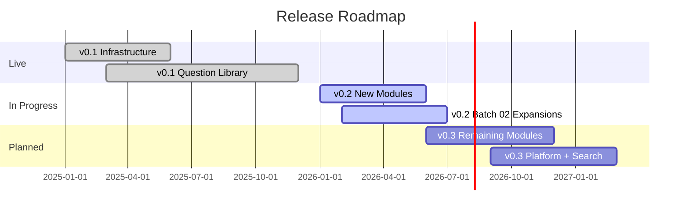

# Roadmap

Current state and planned expansion for the SCAI AI Interview OS.

---

## Status Overview

| Version | Status | Scope |
|---|---|---|
| **v0.1** | ✅ Complete | 7 modules · 155+ questions · full infrastructure |
| **v0.2** | 🔄 Planned | 3 new modules · Batch 02 expansions · 300+ questions |
| **v0.3+** | 📋 Backlog | 2 more modules · 400–600 questions · platform deployment |

---

## ✅ Live Now (v0.1)

### Infrastructure
- 12 module pages covering foundations through operations
- 8 role/persona pages with prep strategies
- 5 experience band definitions with expectations
- Topic dependency graph
- Role × experience matrix
- Interview philosophy and 5-level system
- 4 navigation indexes (module, role, experience, tag)
- Question schema with full metadata

### Question Library
- **Foundations** — 25 questions (Batch 01)
- **Transformer and Modern LLM Internals** — 25 questions (Batch 01)
- **RAG** — 25 questions (Batch 01)
- **Agents and Agentic Systems** — 25 questions (Batch 01)
- **Agent Protocols: MCP / A2A / ACP** — 25 questions (Batch 01)
- **Systems, Serving, and Inference** — 15 questions (Batch 01)
- **MLOps / LLMOps / AIOps** — 15 questions (Batch 01)

**Total: ~155 schema-strict questions across 7 modules**

### Legacy Question Bank
- Modules 00–06 in `modules/` directory with 228 questions in the original format

---

## 🔄 Next (v0.2)

### Question Library Expansion

| Item | Type | Status |
|---|---|---|
| Batch 02 for all 7 live modules | Expansion (15–25 Q each) | Not started |
| **Classical ML** Batch 01 | New module | Not started |
| **Deep Learning Core** Batch 01 | New module | Not started |
| **Alignment / Post-training** Batch 01 | New module | Not started |

### Coverage Targets
- Reach **300+ questions** in the new schema
- Full level coverage (Concept → Architect) for all live modules
- Difficulty 4–5 questions for senior/architect tracks

### Infrastructure
- Cross-module system design question sets
- Mock interview scripts (structured multi-question flows)
- Question difficulty calibration review

---

## 📋 Later (v0.3+)

### Question Library
- **CV and Generative Architectures** — Batch 01
- **Multimodal and VLMs** — Batch 01
- Reach **400–600 questions** total
- Architect-level cross-domain questions

### Features
- Searchable question index with tag filtering
- Role-specific curated sets (top 50 per role)
- Experience band progression paths (guided study orders)
- Scenario-based debugging exercises
- System design interview walkthroughs

### Platform
- Docusaurus or static site deployment
- Cloudflare Pages hosting
- Search functionality
- Progress tracking (optional, community-driven)

### Community
- Contributor question submission pipeline
- Question quality review process
- Community-validated answer improvements

---

## Non-Goals

- This is not a video course platform
- This is not a real-time quiz or assessment tool
- This is not a notes dump or textbook replacement
- Questions test interview readiness, not academic comprehension

---

*Built by [School of Core AI](https://schoolofcoreai.com)*
