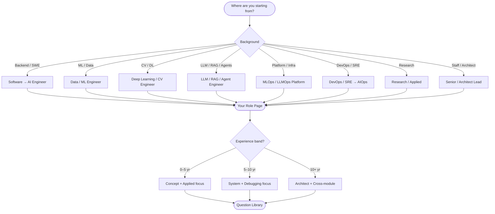

# Start Here

Welcome to the **SCAI AI Interview OS** — a structured, role-aware, experience-calibrated interview preparation system for AI engineers.

This page routes you to the right starting point based on your background, experience, and goals.

---

## How to Navigate

---

## Step 1: Pick Your Role

Your background determines where you should start. Find your closest match:

| Your background | Start with |
|---|---|
| Python / backend engineer moving into AI | [Software Foundations → AI Engineer](personas/software-foundations-to-ai-engineer.md) |
| ML or data engineer | [Data / ML Engineer](personas/ml-data-engineer.md) |
| CV / deep learning engineer | [Deep Learning / CV Engineer](personas/deep-learning-cv-engineer.md) |
| Building copilots, RAG, or agents | [LLM / RAG / Agent Engineer](personas/llm-rag-agent-engineer.md) |
| ML platform or LLM infra | [MLOps / LLMOps / Platform AI](personas/mlops-llmops-platform-engineer.md) |
| DevOps / SRE moving into AIOps | [DevOps / SRE → AIOps](personas/devops-sre-to-aiops.md) |
| Research or applied research | [Research / Applied Research](personas/research-applied-research.md) |
| Senior / staff / architect | [Senior / Architect / AI Systems Lead](personas/senior-architect-ai-systems-lead.md) |

Each role page includes: typical strengths, common gaps, recommended module order, 30-day and 90-day prep strategies, and failure points to watch.

→ [Full Role Index](indexes/role-index.md)

---

## Step 2: Know Your Experience Band

Your experience level determines the depth and difficulty you should target:

| Band | Focus |
|---|---|
| **0–2 years** | Correct foundations, clean implementation, no invented explanations |
| **2–5 years** | Applied reasoning, trade-offs, failure mode awareness |
| **5–8 years** | Production ownership, system design, debugging maturity |
| **8–12 years** | Cross-system design, platform thinking, governance |
| **12–20 years** | Architecture, org-level decisions, operating model, risk management |

→ [Full Experience Index](indexes/experience-index.md) · [Role × Experience Matrix](role-experience-matrix.md)

---

## Step 3: Navigate by Topic

The system covers 12 topic families organized from foundations through operations:

### Core Foundations
- [Foundations](modules/foundations.md) — Python, tensors, statistics, autograd
- [Classical ML](modules/classical-ml.md) — Supervised/unsupervised, evaluation, bias/variance
- [Deep Learning Core](modules/deep-learning-core.md) — Tensors, CUDA, batching, optimization

### Model and Architecture Families
- [CV and Generative Architectures](modules/cv-and-generative-architectures.md) — CNN, GANs, ViT, diffusion
- [Transformer and Modern LLM Internals](modules/transformer-and-modern-llm-internals.md) — Attention, MHA/GQA, KV cache, MoE
- [Multimodal and VLMs](modules/multimodal-and-vlms.md) — CLIP, image-text alignment, VLM evaluation

### Application and Orchestration
- [RAG](modules/rag.md) — Chunking, retrieval, reranking, evaluation
- [Agents and Agentic Systems](modules/agents-and-agentic-systems.md) — Tool calling, planners, memory, governance
- [Agent Protocols: MCP / A2A / ACP](modules/agent-protocols-mcp-a2a-acp.md) — Protocol design and trust

### Production and Operations
- [Systems, Serving, and Inference](modules/systems-serving-and-inference.md) — GPU, quantization, vLLM, deployment
- [Alignment / Post-training](modules/alignment-post-training.md) — SFT, RLHF, DPO
- [MLOps / LLMOps / AIOps](modules/mlops-llmops-aiops.md) — Observability, governance, operations

→ [Full Module Index](indexes/module-index.md) · [Topic Dependency Graph](topic-graph.md)

---

## Step 4: Study Questions

Browse the [Question Library](question-library/) for schema-strict interview questions organized by module and batch.

Each question includes:
- Difficulty rating (1–5)
- Experience band targeting
- Role family relevance
- Expected and deep answers
- Follow-up questions
- Weak answer signals and red flags
- Real-world production insights

→ [Question Library Index](indexes/question-library-index.md)

---

## Step 5: Understand the System

| Document | What it covers |
|---|---|
| [Interview Philosophy](interview-philosophy.md) | The 5-level system, escalation patterns, weak interview signals |
| [Role × Experience Matrix](role-experience-matrix.md) | What is expected per role at each career stage |
| [Topic Graph](topic-graph.md) | Prerequisite dependencies and recommended traversal paths |

---

## Quick Prep Plans

### 7-Day Plan
1. Pick your role → follow the module order on your role page
2. Do top 5–8 questions per priority module
3. Focus on Applied and System levels
4. Review weak answer signals for calibration

### 30-Day Plan
1. Follow your role page's full module order
2. Complete all levels per module
3. Extra time on gap areas from your role page
4. Final week: debugging drills and mock deep dives

### 90-Day Plan
1. Complete the 30-day plan first
2. Add cross-module system design practice
3. Develop architect-level reasoning for your specialization
4. Run mock interviews across all round types

---

*Built by [School of Core AI](https://schoolofcoreai.com). For engineers who build AI systems.*
