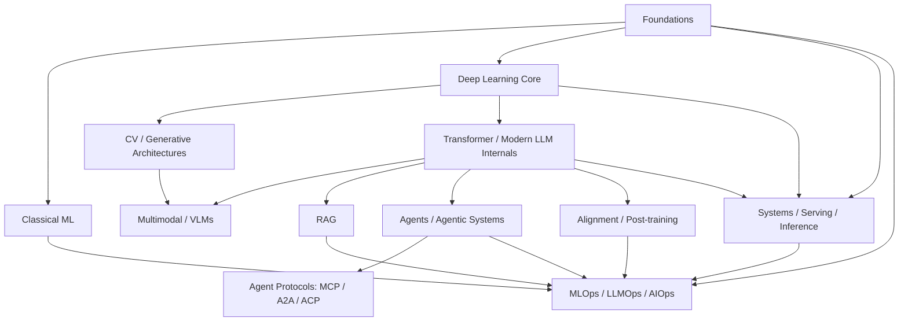

# Topic Graph

AI Interview OS is built as a topic graph, not a flat reading list.

The graph matters because interview depth depends on dependency order. Candidates who skip the dependency structure usually produce shallow answers: they can name the component but cannot explain why it works, what it depends on, or how it fails.

## Graph Principles

1. Foundations unlock model reasoning.
2. Model reasoning unlocks training and inference trade-offs.
3. Retrieval and agents sit on top of model and serving constraints, not outside them.
4. Operations sits across the entire graph and becomes more important with seniority.
5. Research-heavy areas and platform-heavy areas branch from the same base but diverge in depth.
6. No topic exists independently — every module has prerequisites that determine answer quality.

## Top-Level Graph

```text
Foundations (A)
  ├── Classical ML (B)
  ├── Deep Learning Core (C)
  │     ├── CV / Generative Architectures (D)
  │     ├── Transformer / Modern LLM Internals (E)
  │     │     ├── Multimodal / VLMs (F)
  │     │     ├── RAG (G)
  │     │     ├── Agents / Agentic Systems (H)
  │     │     │     └── Agent Protocols: MCP / A2A / ACP (I)
  │     │     ├── Alignment / Post-training (K)
  │     │     └── Systems / Serving / Inference (J)
  │     └── Systems / Serving / Inference (J)
  └── MLOps / LLMOps / AIOps (L)

RAG, Agents, Serving, Alignment, and Operations are mutually reinforcing at senior levels.
```



## Dependency Map by Topic Family

### A. Foundations
**Depends on:** None — this is the root.

**Unlocks:**
- [Classical ML](./modules/classical-ml.md)
- [Deep Learning Core](./modules/deep-learning-core.md)
- [Systems, Serving, and Inference](./modules/systems-serving-and-inference.md) (awareness level)
- [MLOps / LLMOps / AIOps](./modules/mlops-llmops-aiops.md) (awareness level)

**Core internal dependencies:**
- Python → data structures → NumPy/tensor thinking
- linear algebra intuition → gradients → autograd intuition
- probability/statistics → metrics → evaluation reasoning
- optimization basics → training loop intuition

**Why this matters:** Candidates who skip foundations produce shallow answers everywhere else. They can use PyTorch but cannot explain shape flow, gradient behavior, or why a metric is misleading.

### B. Classical ML
**Depends on:**
- Python, statistics, metrics intuition (from A)

**Unlocks:**
- practical evaluation reasoning in deep learning and RAG
- anomaly detection and AIOps use cases
- feature/pipeline thinking for MLOps
- calibration and ranking quality reasoning

**Critical bridge concepts:**
- bias/variance and generalization
- cross-validation and evaluation design
- thresholding and calibration
- model selection under imperfect data
- tree methods vs neural approaches on tabular data

**Interview relevance:** Still appears heavily in data, ML, AIOps, and applied engineering interviews. Even LLM-heavy roles test retrieval evaluation, reranking, and routing—all of which rely on classical ML reasoning.

### C. Deep Learning Core
**Depends on:**
- tensor thinking, optimization basics, compute graph intuition (from A)

**Unlocks:**
- [CV and Generative Architectures](./modules/cv-and-generative-architectures.md)
- [Transformer and Modern LLM Internals](./modules/transformer-and-modern-llm-internals.md)
- [Systems, Serving, and Inference](./modules/systems-serving-and-inference.md)

**Core dependency ladder:**
- tensors → forward pass → loss → backward pass → optimization
- batching → memory → throughput reasoning
- normalization/regularization → stable training
- CUDA intuition → performance and debugging reasoning
- mixed precision → training/inference efficiency

**Why this matters:** The bridge from mathematical intuition to model-building and production debugging. Separates candidates who use models from those who understand why models train, diverge, or slow down.

### D. Vision / Sequence / Generative Architectures
**Depends on:**
- Deep Learning Core (C)

**Branches into:**
- CNN/ResNet/YOLO/U-Net — production vision roles
- RNN/LSTM/GRU — sequence foundations (historical but interviews still test the reasoning)
- Transformers/ViT — bridge to modern multimodal systems
- Autoencoders/GANs/Diffusion — generative and research interviews
- Mamba/state-space models — modern architecture comparison

**Role-dependent depth:**
- CV engineers need deep CNN/ResNet/YOLO/U-Net/ViT/diffusion
- Research roles need broad architecture comparison across all families
- LLM roles need ViT awareness for multimodal context only
- Platform/ops roles need shallow conceptual awareness

### E. Transformer / Modern LLM Internals
**Depends on:**
- Deep Learning Core (C)
- sequence modeling intuition (from D, lightly)

**Unlocks:**
- [Multimodal and VLMs](./modules/multimodal-and-vlms.md)
- [RAG](./modules/rag.md)
- [Agents and Agentic Systems](./modules/agents-and-agentic-systems.md)
- [Systems, Serving, and Inference](./modules/systems-serving-and-inference.md)
- [Alignment / Post-training](./modules/alignment-post-training.md)

**Internal dependency ladder:**
- tokenization → embeddings → positional encoding → attention
- attention → MHA → GQA / MQA (serving-motivated variants)
- positional encoding → RoPE → long-context behavior
- attention memory costs → KV cache → inference optimization
- scaling intuition → MoE → model/router trade-offs
- inference trade-offs → reasoning vs latency vs cost

**Why this is high-value:** One of the highest-signal modules. Interviewers use it to distinguish API familiarity from actual model understanding. Strong answers connect internal mechanics to latency, memory, serving constraints, and model economics.

### F. Multimodal / VLMs
**Depends on:**
- Transformer internals (E)
- vision architecture intuition (D)

**Key dependencies:**
- image encoder basics (ViT, CNN backbone awareness)
- text encoder basics (transformer representations)
- alignment objectives (contrastive learning, CLIP-style)
- retrieval and grounding evaluation

**Maturity note:** Not every role needs this deeply. Highest priority for CV engineers, research roles, and multimodal product roles.

### G. RAG
**Depends on:**
- embeddings and retrieval intuition (from E)
- LLM prompting and context limits (from E)
- evaluation basics (from A and B)

**Internal dependency ladder:**
- ingestion → chunking → indexing → retrieval → reranking → context assembly → generation → evaluation

**Advanced branches:**
- metadata filtering and hybrid search
- graph RAG (depends on strong basic RAG first)
- citation/grounding design
- failure analysis and production debugging

**Critical rule:** Do NOT start with graph RAG before basic retrieval quality and evaluation are clear.

### H. Agents / Agentic Systems
**Depends on:**
- tool calling and structured outputs (from E)
- prompt/control flow reasoning (from E)
- retrieval and external system interaction (from G, partially)

**Internal dependency ladder:**
- single-step tool use → looped tool use → planning → memory → supervisor patterns → multi-agent coordination → governance and HITL

**Critical rule:** Do NOT start with multi-agent systems before you can build a single safe tool-using agent.

### I. Agent Protocols (MCP / A2A / ACP)
**Depends on:**
- basic agent/tool architecture (from H)
- distributed systems and trust assumptions

**Interview expectation by band:**
- 0–2 years: conceptual differentiation only
- 2–5 years: know integration boundaries and trade-offs
- 5–8 years: know where protocol fit changes system architecture
- 8+ years: security, identity, governance, and platform implications

**Maturity note:** This ecosystem is still evolving. MCP has strongest practical relevance today. A2A is growing. ACP should be treated with nuance. Do not pretend all three are equally mature or adopted.

### J. Systems / Serving / Inference
**Depends on:**
- model internals (from C and E)
- latency/throughput/memory thinking (from C)
- CUDA/memory intuition (from C)

**Internal dependency ladder:**
- eager execution → compilation → batching → memory management → serving stacks → routing/cost control

**Key topics:**
- GPU memory: KV cache, activation, model weights
- vLLM: PagedAttention, continuous batching, scheduling
- TGI: deployment patterns, batching strategies
- quantization: quality/speed trade-offs (GPTQ, AWQ, GGUF)
- multi-model serving and routing

### K. Alignment / Post-training
**Depends on:**
- supervised fine-tuning intuition (from C and E)
- evaluation basics (from A and B)
- model behavior shaping intuition

**Interview branches:**
- Product/system roles: when to prefer prompting, retrieval, or fine-tuning over RLHF/DPO
- Research roles: RLHF mechanics, DPO, reward models, policy optimization trade-offs
- All roles: must understand these as one lever among several, not the default answer

**Critical rule:** Do NOT start with RLHF before you can explain SFT, prompting, retrieval, and inference trade-offs.

### L. MLOps / LLMOps / AIOps
**Depends on:**
- pipeline thinking (from A and B)
- evaluation (from A, B, and role-specific modules)
- deployment (from J)
- observability fundamentals

**Internal dependency ladder:**
- experiment tracking → versioning → deployment → monitoring → rollback → drift/incident handling → governance

**Sub-disciplines:**
- MLOps: training pipelines, model registry, retraining, validation gates
- LLMOps: prompt lifecycle, online evals, tracing, token cost, fallback logic
- RAGOps: index freshness, retrieval monitoring, chunk governance, grounding quality
- AgentOps: trajectory tracing, tool reliability, budget controls, loop detection
- AIOps: anomaly detection, alert triage, incident assistance, automation boundaries

---

## Recommended Traversal Paths

### Software-to-AI Path
[Foundations](./modules/foundations.md) → [Deep Learning Core](./modules/deep-learning-core.md) → [Transformer and Modern LLM Internals](./modules/transformer-and-modern-llm-internals.md) → [RAG](./modules/rag.md) → [Agents and Agentic Systems](./modules/agents-and-agentic-systems.md) → [Systems, Serving, and Inference](./modules/systems-serving-and-inference.md)

### ML-to-Production Path
[Classical ML](./modules/classical-ml.md) → [Deep Learning Core](./modules/deep-learning-core.md) → [Systems, Serving, and Inference](./modules/systems-serving-and-inference.md) → [MLOps / LLMOps / AIOps](./modules/mlops-llmops-aiops.md) → [RAG](./modules/rag.md)

### Research-to-Production Path
[Deep Learning Core](./modules/deep-learning-core.md) → [CV and Generative Architectures](./modules/cv-and-generative-architectures.md) and/or [Transformer and Modern LLM Internals](./modules/transformer-and-modern-llm-internals.md) → [Alignment / Post-training](./modules/alignment-post-training.md) → [Systems, Serving, and Inference](./modules/systems-serving-and-inference.md)

### Platform / Ops Path
[Foundations](./modules/foundations.md) → [Systems, Serving, and Inference](./modules/systems-serving-and-inference.md) → [MLOps / LLMOps / AIOps](./modules/mlops-llmops-aiops.md) → [RAG](./modules/rag.md) → [Agents and Agentic Systems](./modules/agents-and-agentic-systems.md) → [Agent Protocols: MCP / A2A / ACP](./modules/agent-protocols-mcp-a2a-acp.md)

### CV / Multimodal Path
[Deep Learning Core](./modules/deep-learning-core.md) → [CV and Generative Architectures](./modules/cv-and-generative-architectures.md) → [Transformer and Modern LLM Internals](./modules/transformer-and-modern-llm-internals.md) → [Multimodal and VLMs](./modules/multimodal-and-vlms.md) → [Systems, Serving, and Inference](./modules/systems-serving-and-inference.md)

### LLM / Agent Path
[Foundations](./modules/foundations.md) → [Deep Learning Core](./modules/deep-learning-core.md) → [Transformer and Modern LLM Internals](./modules/transformer-and-modern-llm-internals.md) → [RAG](./modules/rag.md) → [Agents and Agentic Systems](./modules/agents-and-agentic-systems.md) → [Agent Protocols: MCP / A2A / ACP](./modules/agent-protocols-mcp-a2a-acp.md) → [MLOps / LLMOps / AIOps](./modules/mlops-llmops-aiops.md)

---

## What Not to Study Too Early

- Do not start with **graph RAG** before basic retrieval quality and evaluation are clear.
- Do not start with **RLHF** before you can explain SFT, prompting, retrieval, and inference trade-offs.
- Do not start with **multi-agent systems** before you can build a single safe tool-using agent.
- Do not study **MoE** only as a buzzword; it depends on routing, scaling, and systems cost reasoning.
- Do not treat **MCP, A2A, and ACP** as foundational model topics. They sit later in the graph because they matter after you already understand tools, agents, trust, and integration boundaries.
- Do not jump into **diffusion models** before understanding autoencoder and GAN fundamentals.
- Do not study **Mamba** before understanding the attention cost problems it aims to address.
- Do not treat **quantization** as free; it depends on understanding model precision, memory, and quality trade-offs.

## How Interviews Traverse the Graph

- **Screening rounds** usually test the first 2 layers of the graph (A, B, C basics).
- **Technical rounds** move into implementation and trade-off branches (E, G, H applied).
- **Deep dives** test whether you can move laterally across the graph: model internals → retrieval → serving → debugging.
- **System design rounds** test whether you can hold multiple branches at once (E + G + J + L).
- **Research discussions** test whether you understand the branch assumptions and can defend architecture choices (C + D + E + K).
- **Production/debugging rounds** test lateral movement from symptoms to root causes across branches.

---

## Cross-References

- [Role Experience Matrix](./role-experience-matrix.md) — what each role needs from the graph
- [Interview Philosophy](./interview-philosophy.md) — how the 5-level system maps to graph depth
- [Module Index](./indexes/module-index.md) — all 12 modules with sequences
- [Experience Index](./indexes/experience-index.md) — graph entry by career band
